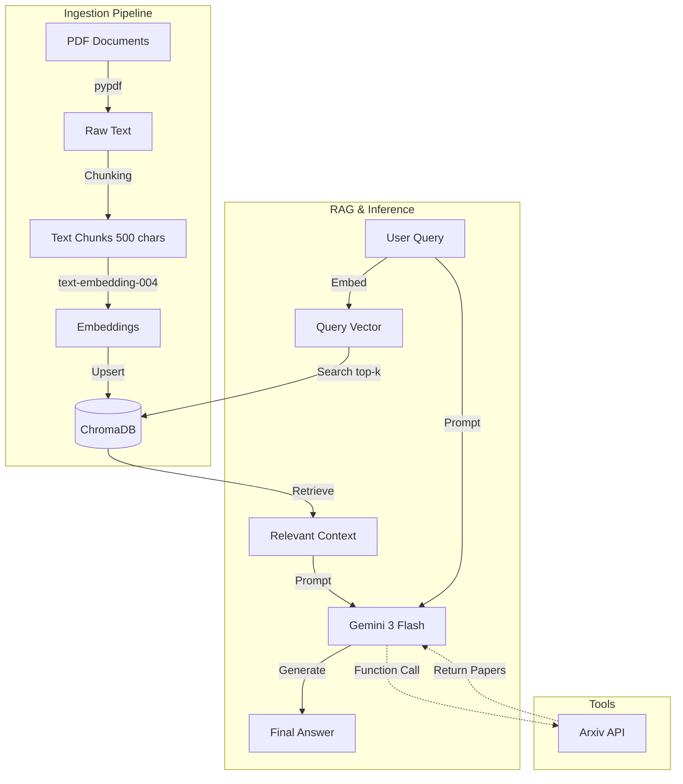

# 🤖 Enterprise Document Q&A AI Agent


An enterprise-grade **Retrieval-Augmented Generation (RAG)** AI agent capable of ingesting PDF documents and answering complex queries with citation-backed accuracy. Built using **Google Gemini** and **ChromaDB**.

## ✨ Key Features

-   **Multi-Modal Intelligence**: Leveraging **Gemini 3 Flash** for high-speed, cost-effective reasoning.
-   **Custom RAG Pipeline**: A specialized ingestion & retrieval system built from scratch without heavy framework dependencies.
    -   **Granular Chunking**: Splits documents into semantic 500-char chunks for precise retrieval.
    -   **Semantic Search**: Uses `models/text-embedding-004` to understand query intent.
    -   **Vector Storage**: Local persistence using **ChromaDB** for fast retrieval.
-   **Agentic Capabilities**: 
    -   **Arxiv Tool**: Can autonomously search Arxiv for external research papers when the internal knowledge base is insufficient.
    -   **Context-Aware**: Maintains conversation history.
-   **Interactive UI**: Clean **Streamlit** dashboard for easy document management and chat.

---

## 🔍 Architecture



## 📂 Project Structure

A breakdown of the codebase and its components:

```
Callus/
├── .env                     # API Keys (Not committed to Git)
├── .gitignore               # Git exclusion rules
├── requirements.txt         # Python project dependencies
├── README.md                # Project documentation
│
├── src/                     # Source Code Directory
│   ├── app.py               # 🖥️ Main Application (Streamlit UI)
│   │                        # Handles user interaction, file uploads, and chat loop.
│   │
│   ├── engine.py            # 🧠 RAG & AI Engine
│   │                        # Connects to Gemini, runs the Retrieval logic,
│   │                        # and manages the Chat Session.
│   │
│   ├── ingestion.py         # ⚙️ Data Pipeline
│   │                        # Handles PDF parsing, Text Chunking, Embedding,
│   │                        # and storing vectors in ChromaDB.
│   │
│   ├── config.py            # 🔧 Configuration
│   │                        # Centralized setup for Google Generative AI SDK.
│   │
│   └── arxiv_tool.py        # 📚 External Tools
│                            # Tool definition for searching Arxiv papers.
│
├── chroma_db/               # 💾 Local Vector Database
│                            # Stores the embedded document chunks (Auto-generated).
│
└── data/                    # 📥 Data Cache
                             # Temporary storage for uploaded PDF files.
```

---

## 🚀 Setup & Installation

**Prerequisites**: Python 3.10+ and a Google Gemini API Key.

1.  **Clone the Repository**
    ```bash
    git clone https://github.com/Aakhilshaik204/Callus-Stochastic.git
    cd Callus-Stochastic
    ```

2.  **Install Dependencies**
    ```bash
    pip install -r requirements.txt
    ```

3.  **Configure Environment**
    Create a `.env` file in the root directory and add your API Key:
    ```env
    GOOGLE_API_KEY=your_actual_api_key_here
    ```
    *(Get your key from [Google AI Studio](https://aistudio.google.com/app/apikey))*

---

## 💡 How to Use

1.  **Launch the Application**
    ```bash
    streamlit run src/app.py
    ```

2.  **Ingest Documents**
    -   Open the sidebar.
    -   Upload your PDF research papers.
    -   Click **"Process Documents"**.
    -   *Observe the terminal to see text extraction logs.*

3.  **Chat with your Agent**
    -   Ask specific questions like *"What is the methodology in the VISTA paper?"* or *"Summarize the limitations."*
    -   The Agent will retrieve relevant chunks from **ChromaDB** and generate an answer using **Gemini**.

4.  **Use External Tools**
    -   Ask *"Search Arxiv for papers on Large Language Models"* to trigger the external search tool.

5.  **Reset Knowledge Base**
    -   Click **"Reset Knowledge Base"** in the sidebar to wipe the database and start fresh.

---


### Flow Details

1.  **Ingestion**:
1.  **PDF Loading**: Uses `pypdf` to extract raw text.
2.  **Chunking**: Text is split into overlapping chunks of 500 characters.
3.  **Embedding**: Each chunk is converted into a vector using `text-embedding-004`.
4.  **Indexing**: Vectors + Metadata are stored in the local `chroma_db`.

### The Retrieval Flow
1.  **Query Embedding**: User question is embedded.
2.  **Vector Search**: System retrieves top 15 most similar chunks from ChromaDB.
3.  **Synthesis**: Detailed context is fed to Gemini 3 Flash to generate a grounded response.
